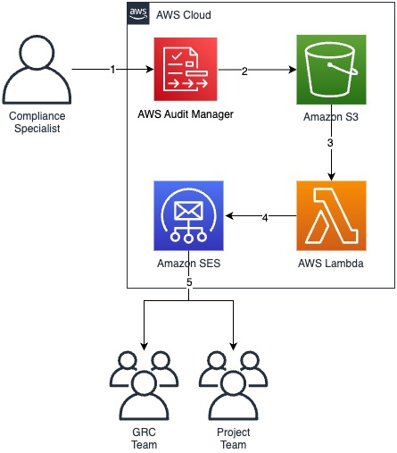

## Automate the sending of AWS Audit Manager Assessment Reports

# Overview

Reference solution to automated the sending of AWS Audit Manager assessment report suammry to stakeholde's email inbox

# Architect Diagaram

# Prerequistes

You must first complete the following pre-requisites to operationalize configuration for the reports:

* AWS Audit Manager needs to be deployed - [Getting started with AWS Audit Manager](https://docs.aws.amazon.com/audit-manager/latest/userguide/getting-started.html)
* Amazon S3 bucket should be set to receive the assessment report summary
* The solution providers 3 email address that can receive the assessment report, fill in at least Email Address 1 to receive the email containing the report
* In this blog, we are assuming that your Amazon SES are in [sandbox mode](https://docs.aws.amazon.com/ses/latest/dg/request-production-access.html). That’s why once the solution is deployed, you need to make sure to go to your email inbox and click on the validation link sent by SES

## Security

See [CONTRIBUTING](CONTRIBUTING.md#security-issue-notifications) for more information.

## License

This library is licensed under the MIT-0 License. See the LICENSE file.

